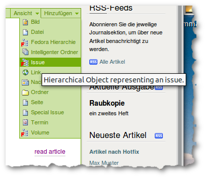

Jahrgänge und Ausgaben
######################

Jahrgänge, Ausgaben und Sonderausgaben dienen dazu, die Artikel hierarchisch
einzuordnen. Im Gegensatz zu Artikeln, die über die Editorial Toolbox
eingestellt werden, werden diese jedoch wie normale Ploneobjekte über das
“Hinzufügen” Menu in der grünen Bearbeitungsleiste angelegt.

    Hinzufügen von hierarchischen Elementen wie Ausgaben (Issue), Jahrgänge (Volume)
    oder Sonderausgaben (Special Issue)

Sektionen sind keine eigenständigem Objekte, sondern nur eine weiter Eigenschaft
eines Artikels, die über die Metadaten ausgewählt wird.

.. _volumes:

Jahrgänge, Ausgaben und FedoraHierarchien
*****************************************

Diese drei Typen unterscheiden sich prinzipiell nur durch ihre Standardansicht,
die über das "Ansichten" Menu ausgewählt werden kann. FedoraHierarchien sollten
nicht mehr verwendet werden und werden nur aus Gründen der
Rückwärtskompatibilität weiterhin vom System unterstützt.

================= ================
Typ               Ansicht
================= ================
Jahrgang (Volume) Volume content
Ausgabe (Issue)   Issue content
FedoraHierarchie  Base View
================= ================

Volume content
--------------

Diese Template listet nur die direkt im aktuellen Jahrgang angelegten Ausgaben
an. Evtl. weiter vorkommende Jahrgänge, Ausgaben und Fedorahierachien werden
ebenfalls gelistet, alles andere wird ignoriert. Wenn die untergeordneten
Ausgaben Titelbilder haben, können diese eingeblendet werden, siehe
:ref:`prop_volume_show_covers`

Issue content
-------------

.. _sonderausgaben:

Sonderausgaben
**************

.. _sektionen:

Sektionen
*********
