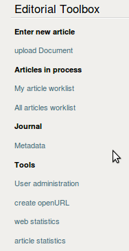

.. _editorial_toolbox:

Editorial Toolbox
#################

Einstiegspunkt für das Konvertieren der Artikel ist immer die Editoral Toolbox,
die über die sogenannte :term:`Personal bar` am oberen Rand oder in der linken
Navigation erreichbar ist.

upload Document:
    Dient zum Hochladen und (Test)konvertieren eines Artikel.

Meine Artikelliste:
    Eine tabellarische Übersicht mit Artikeln, die noch nicht veröffentlicht sind 
    und mir zum Bearbeiten zugewiesen sind.

Alle Artikel:
    Eine tabellarische Übersicht mit Artikeln, die noch nicht veröffentlicht sind 
    aber noch niemanden zugewiesen wurden, bzw. aktuell nicht bearbeitet werden.

Metadaten:
    Die Metadaten der Zeitschrift selber. Sie werden in der Regel nur bei Gründung
    des Journal angelegt und später nur editiert, wenn sich beispielsweise ein
    Herausgeber ändert.

Benutzerverwaltung:
    Eine Abkürzung zu Plones Nutzerverwaltung. Sie ist ebenfalls über "Konfiguration"
    erreichbar

openURL erzeugen:
    Ein `simples Webformular <http://www.dipp.nrw.de/openurl.html>`_ zur Erzeugung 
    von OpenURLs, die zur Verfügbarkeitsrecherche verwendet werden können.

allg. Webstatistik:
    Graphische Auswertung der Zugangsstatistiken mit 
    `AWStats <http://awstats.sourceforge.net/>`_ Ist nur für produktive Journals mit
    eigener Domain verfügbar, nicht auf dem Testsystem.

artikelbasierte Statistik:
    Zugriffszahlen auf die Artikel. Basiert auf den allg. Webstatistiken und ist daher
    auch nur für produktive Journals verfügbar.
    
    

    Die Editorial Toolbox

 
