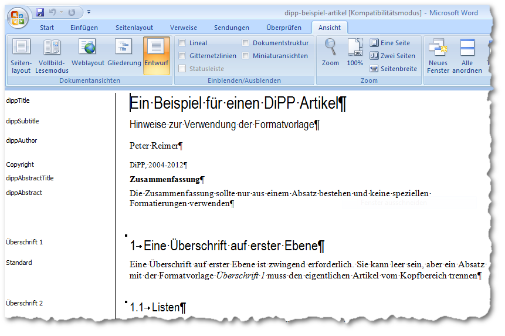
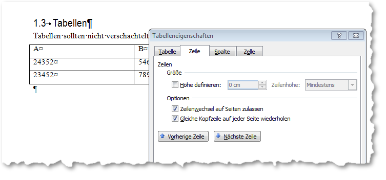

.. _artikel-formatieren:

Artikel formatieren
###################

Grundlage für eine erfolgreiche Artikelkonvertierung ist die korrekte Verwendung
der :download:`Formatvorlage <../../rtf/dipp-beispiel-artikel.rtf>`.
Wichtig sind vor allem die Formate für den  Kopf des Artikels,
der die Metadaten enthält. Anhand der Namen der Absatzformate identifiziert die
Konvertierungsoftware  den Titel, die Autoren, den Abstract, etc. Danach wird eine
Überschrift erster Ordung benötigt, um den eigentliche  Artikeltext von den Metadaten
zu trennen.

.. attention::
   Ein Absatz mit dem Absatzformat "Überschrift 1" ist zwingend vorgeschrieben.
   Er kann leer sein, muss aber existieren, da der Konverter ansonsten nicht
   erkennt, wo der eigentliche Artikel beginnt.

    Ein Artikel mit angewandter Formatvorlage. Entwurfsansicht mit
    eingeblendeten Absatzformaten

Die Standardformatvorlage enthält eine Reihe von Absatzformaten, die im Artikelkopf
angewendet werden können, bzw. müssen. Die bezeichnung und die Reihenfolge ist
wichtig, kann jedoch an die jeweiligen Bedürfnisse angepasst werden. Dafür ist
jedoch auch eine Anpassungen der journalspezifischen XSL und XSLT Datei für die
Konvertierungssoftware notwendig.

================== ========================================================
Name der Vorlage   Bedeutung
================== ========================================================
dippTitle          Titel der Artikels, erforderlich.
dippSubtitle       evtl. Untertitel
dippAuthor         ein oder mehrere Autoren
Copyright          enthält nach der Konvertierun die URN
dippAbstractTitle  Überschrift für den Abstract, kann nur einmal vorkommen
dippAbstract       der Abstract selber
================== ========================================================

Im Fließtext des Artikel sind die Einschränkungen nicht so restriktiv, es
können auch eigene Formate ergänzt werden, allerdings werden die in Word
gemachten Formatierung wie z.B. Einrückungen, Schriftgrad oder Farbe nicht
automatisch in die HTML Ausgabe übernommen. Diese müssen manuell in den CSS
Dateien nachgezogen werden. Da der Name des Absatzformates zum Klassennamen in
der CSS Datei wird, darf er keine Sonderzeichen oder Leerzeichen enthalten.

In der Regel sollten die Funktionen der Textverarbeitung genutzt werden:

* Normale Absätze werden mit der Formatvorlage "Standard" formatiert.

* Für Überschriften werden die üblichen "Überschrift 1, Überschrift 2, ..."
  verwendet. Aus den Überschriften wird dann das Inhaltsverzeichnis generiert,
  das als toc_html parallel zum Hauptext (fulltext) abeglegt wird. Über ein
  entsprechendes Portlet es in einer Randspalte angezeigt werden, siehe :ref:`portlet_toc`.

* Fußnoten sollten mit der Fußnotenfunktionen von Word gemacht werden. Zwischen
  Fuß- und Endnoten kann wegen fehlender Pagnierung in HTML nicht unterschieden
  werden.

* Hyperlinks sollten bereits in Word als solche angelegt werden.

* Aufzählungen und Nummerierungen sollten mit der entsprechenden Funktion in
  Word angelegt werden.

* Beschriftungen von Tabellen und Abbildungen sind ebenfalls mit der
  entsprechenden Funktion von Word zu erstellen.

Abbildungen
***********

Es sind nur pixelbasierte Dateiformat (jpeg, gif, png) möglich, vektorbasierte
Formate wie z.B. wmf oder mit Wordart erstellte Graphiken werden nicht
unterstützt.

Bilder sind in der Auflösung einzubinden, in der sie später im Internet
erscheinen sollen. Abhängig vom Layout der Webseite sollte die Breite 580px
nicht überschreiten. Die Bilder können mit Verweisen (hyperlinks) zu
höherauflösenden Versionen versehen werden, die im Publikationssystem
nachträglich hochgeladen werden können, siehe :ref:`zusatzmaterial`.

Tabellen
********

Tabellen sollten nicht zu komplex gestaltet werden, d. h. sie sollten nicht
verschachtelt werden und die Größe einzelner Zellen sollten nicht durch Ziehen
der Begrenzungslinie verändert werden. Das Verschmelzen von zwei benachbarten
Zellen ist jedoch möglich. Auch sollte Für die erste Tabellenzeile als Kopfzeile
gesetzt werden. Dazu wird die Zeile in Word markiert und dann über das
Kontektmenü "Tabelleneigenschaft", Reiter "Zeile" die Option "Gleiche Kopfzeile
auf jeder Seite wiederholen" aktiviert. Dadurch wird die Zeile im HTML als header
ausgezeichnet und läßt sich entsprechend über CSS formatieren.

    Setzen der Eigenschaften für die Kopfzeile der Tabelle
