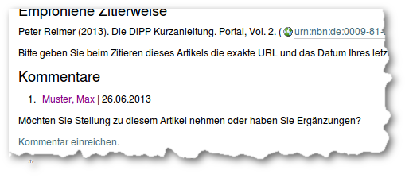
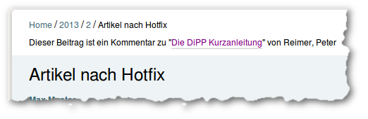

Kommentare
##########

Kommentare zu Artikeln sollen dazu dienen eine Diskussion 
zu ermöglichen und sollten daher gewissen wissenschaftlichen Standard genügen.
Zwar durchlaufen die Kommentare keinen Reviewprozess, technischen werden sie
aber genauso behandelt wie der kommentierte Artikel selber, d.h. sie werden 
genauso :ref:`formatiert <artikel-formatieren>` und über die Editorial Toolbox konvertiert.

In der Standardkonfiguration ist die Kommentarfunktion deaktiviert. Um sie
nutzen zu können muss im :term:`ZMI` der Wert von
:ref:`allow_persistent_discussion` auf "True" gesetzt werden. 

    Ein Artikel mit angewandter Formatvorlage. Entwurfsansicht mit 
    eingeblendeten Absatzformaten

    Ein Artikel mit angewandter Formatvorlage. Entwurfsansicht mit 
    eingeblendeten Absatzformaten

