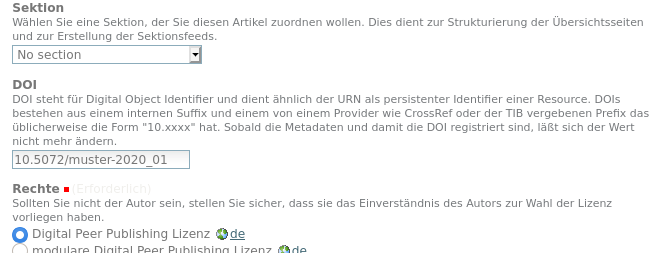

Persistente Identifikatoren
===========================

Da es für URLs keine Garantie gibt, dass sie langfristig stabil sind, sind sie nicht geeignet um einen
Artikel zu identifizieren und dauerhaft zitieren zu können. Diese Aufgabe übernehmen Persistente Identifikatoren,
die über einen Resolvingmechanismus dafür sorgen, das immer zur aktuellen URLs des digitalen Objektes
aufgelöst wird. 

Digital Object Identifier (DOI)
-------------------------------

Die Nutzung von DOIs setzt voraus, dass sich ein teilnehmendes Journal bei einem DOI-Provider registriert
und einen eigenen DOI-Prefix beantragt. Dieser Prefix und die Zugangsdaten werden dann über die 
:ref:`portal_doiregistry <portal_doiregistry>` konfiguriert. 

Erst wenn der Zugang zu DataCite konfiguriert ist, wird das Metadatenformular um ein Feld erweitert, in dem man
eine frei wählbare DOI eintragen kann.

    Auschnitt aus dem Metadatenformular

Vor dem Speichern wird validiert, ob die DOI formal korrekt ist (richtiges Prefix, keine nicht-erlaubten Zeichen)
und ob sie noch nicht vergeben ist, bzw. als :ref:`reservierte DOI <doi_reserved>` aufgeführt ist.

Sobald die DOI registriert ist, wird das Feld ausgegraut, d.h. man kann es nicht mehr editieren.

Uniform Resource Name (URN)
---------------------------

Die URN Vergabe erfolgt automatisch und kostenfrei im Namensraum des hbz, bzw. der DiPP Initiative: urn:nbn:de:0009
Jedes Journal erhält eine eigene Nummer und jeder Artikel eine automatisch vergebene eindeutige Nummer. 
Einschließlich der abschließenden Prüfziffer hat die URN dann folgendes Format::

    urn:nbn:de:0009-<journal_id>-<article_id><prüfziffer>

Die Registrierung bei der DNB erfolgt dann halbautomatisch über die OAI-Schnittstelle.
