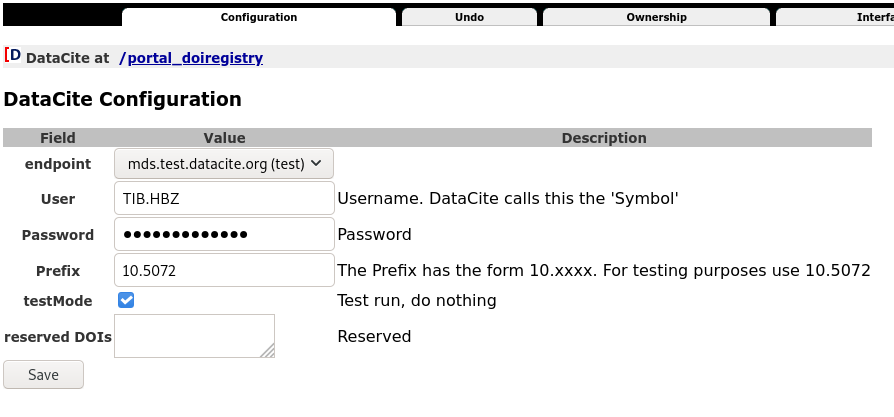

portal_doiregistry
******************

.. _portal_doiregistry:

Für die Anbindung des Publikationssystems an Datacite wurde ein sog. :ref:`Tool <tool_datacite>` entwickelt,
Die Einstellungen für die :term:`DOI` Registrierung werden über das ZMI gemacht: :menuselection:`ZMI --> portal_doiregistry`.

    Konfiguration der DataCite Anbindung

.. _doi_endpoint:

endpoint
========

Datacite bietet zwei Endpoints an, über die DOIs registriert werden können, einen
für das Test- und einen für das Livesystem:

 * mds.test.datacite.org
 * mds.datacite.org

.. _doi_user_password:

User/ Password
==============

Von Datacite vergebene Zugangsdaten.

.. _doi_prefix:

Prefix
======

Prefix des Identifiers in der Form 10.xxxx. Zu Test- und Entwicklungszwecken gibt es das Prefix 10.5072

.. _doi_testmode:

testMode
========

Wenn die Option gesetzt wird, wird zwar die API von DataCite angesprochen, es werden aber
keine DOIs registriert. Nur zum Entwickeln und Debuggen nützlich.

.. _doi_reserved:

reserved DOIs
=============

Hier können DOIs eingetragen werden, die nicht vergeben werden sollen. Das Metadatenformular
quittiert den Versuch mit einer Fehlermeldung.

