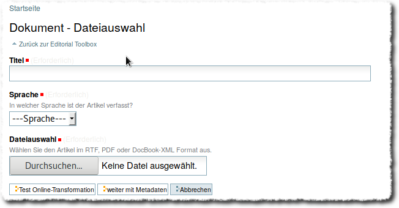
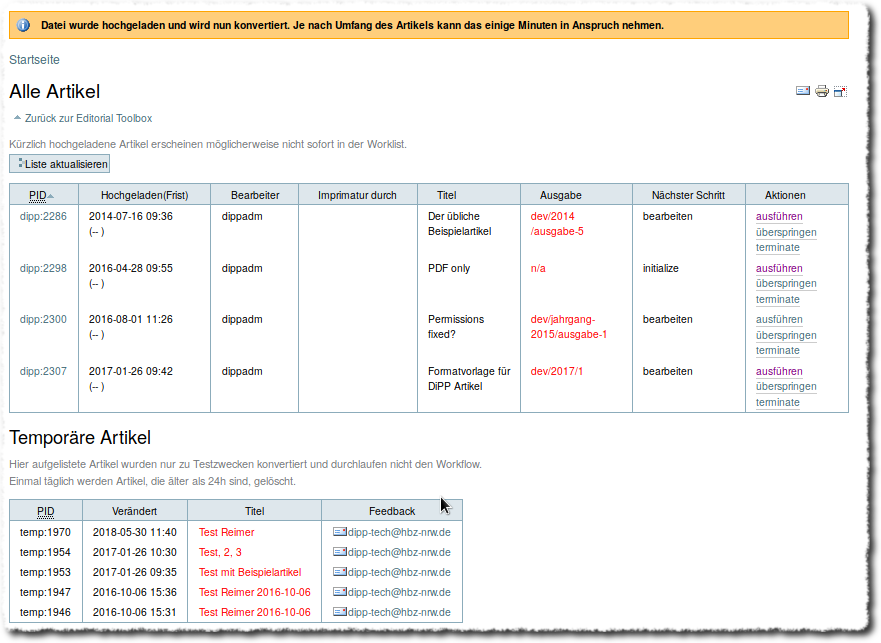
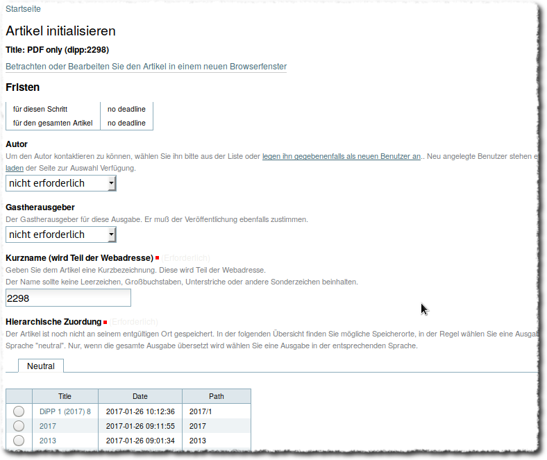
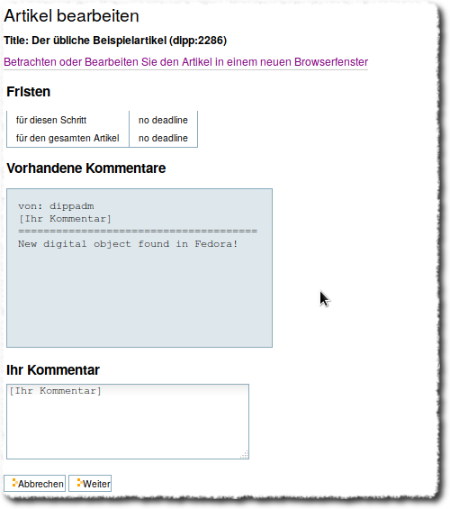
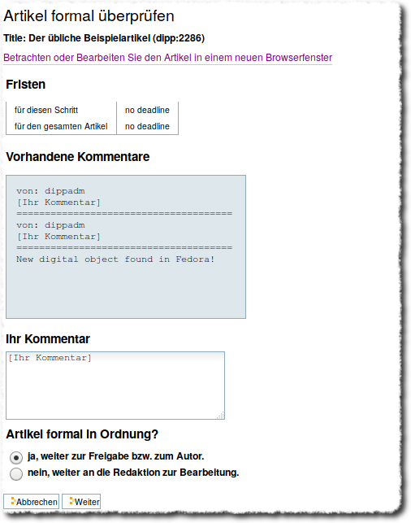
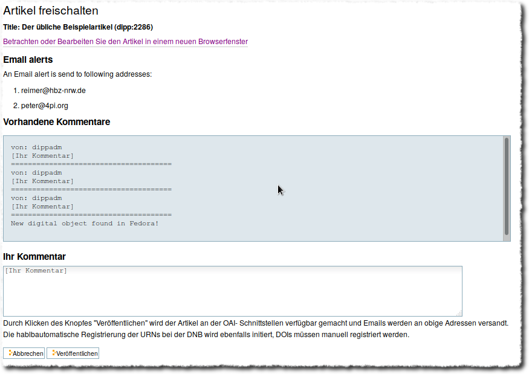

Publikationsworkflow
====================

Upload
------

Den Einstieg in den Publikationsworkflow erreicht man über die :ref:`editorial_toolbox`. Der erste Menupunkt unter
Neue Artikel eingeben/ Dokument hochladen führt zu folgender Eingabemaske:

    Eingabemaske zum Artikelupload

Alle drei Felder sind zwingend auszufüllen, bzw. auszuwählen. Da in der Regel mehrere Probeläufe der Konvertierung
nötig sind, bis das ausgegebene HTML den Erwartungen entspricht, hat man an diesem Punkt zwei Wahlmöglichkeiten:

Im ersten Fall :guilabel:`Test Online Transformation` ist keine Angabe von Metadaten notwendig und der eigentliche
Publikationsworkflow wird nicht angestoßen. Der konvertierte Artikel landet in einen Ordner für temporäre Dateien.
Im Fall von :guilabel:`weiter mit Metadaten` muss ein umfangreiches Metadatenformular ausgefüllt werden und der Workflow
wird angestoßen.

Je nach Länge und Komplexizität des Artikel dauert die Konvertierung unterschiedlich lange. In beiden Fällen wird man
nach der Konvertierung zur sog. Worklist weitergeleitet.

Worklist
--------

Die Worklist ist der Dreh- und Angelpunkt, zu dem man nach jedem einzelnen Schritt
wieder zurückgeleitet wird. Artikel, die mit Metadaten hochgeladen bzw. konvertiert wurden
finden sich in der oberen Liste, Testkonvertierungen in der Tabelle darunter.

    Eine Übersicht aller im Publikationsworkflow befindlichen Artikel. Im unteren
    Teil werden die Artikel aufgeführt, die nur zu Testzwecken konvertiert wurden
    und nicht veröffentlicht werden sollen.

Der für den jeweiligen Artikel nächste Schritt ist in der vorletzten Spalte angegeben,
mit dem 'ausführen'-Link in der letzten Spalte wird der Schritt gestartet.

1. Schritt: Artikel initialisieren
----------------------------------

Nach dem Konvertieren befinden sich die Artikel in einem temporären Ordner. Für die
entgültige Veröffentlichng muss zunächst unter 'Hierarchische Zuordnung' ein
bereits bestehender :ref:`volumes_issues` Ordner ausgewählt werden.

    Erster Schritt im Workflow: Initialisieren

Artikel bearbeiten
------------------

    Zweiter Schritt im Workflow: Bearbeiten

Artikel begutachten
-------------------

    Dritter Schritt im Workflow: Begutachten

Artikel freischalten
--------------------

    Letzter Schritt im Workflow: Freischalten

Bei Veröffentlichung des Artikels wird eine Email an vorher definiert
Adressen :ref:`prop_alertEmailAddresses` verschickt, der Text ist auch
anpassbar.
