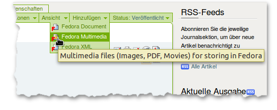
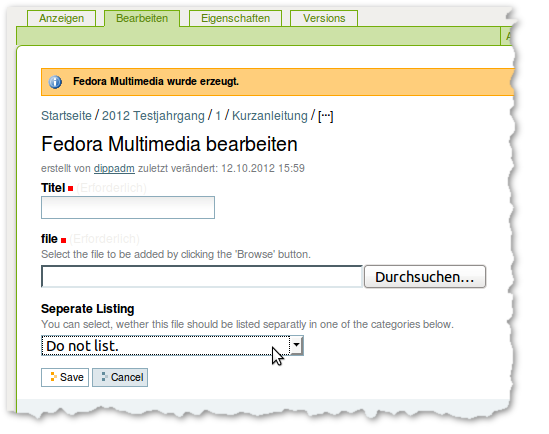

.. _zusatzmaterial:

Zusatzmaterial
##############

Unter Zusatzmaterial (supplementary material) lassen sich alle Bestandteile des
Artikel zusammenfassen, die **nicht** durch die Konvertierung des Artikels aus dem RTF
erhalten werden. Dazu gehören z.B. Bilder in höheren Auflösungen, Multimediale
Inhalte oder der Volltext des Artikel im PDF Format.

Diese Zusatzmaterialien werden über das "Hinzufügen" Menu in der grünen
Bearbeitungsleist ergänzt. Zur Verfügung stehen "Fedora Document", das für
textbasierte Materialen wie HTML Datein gedacht ist, und "Fedora Multimedia"
für alle binären Formate: Bilder, PDF Dateien, Film- und Audiodateien, etc.

    Hinzufügen von Zusatzmaterial über das "Hinzufügen" Menü.

In dem dann folgendem Formular muss der Titel angegeben werden und die Datei
ausgewählt werden. Das Auswahlfeld "seperate Listing" entscheidet darüber, wie
das Zusatzmaterial eingebunden wird:

Do not list:
    Die Datei wird nicht offensichtlich verlinkt, sondern kann beispielsweise
    als Bild im HTML Text eingebunden werden. Auf diese Art werden auch Bilder
    eingebunden, die durch die Konvertierung aus dem RTF extrahiert werden.

Alternative Format of the main text:
    Für die PDF Version des volltextes. Die Datei wird über ein kleines Icon am
    rechten oberen Rand verlinkt. Zusätzlich erscheint ein Textlink unterhalb
    des Artikel, der zusätzlich eine Größenangabe enthält. Wenn dem Artikel mehrere
    PDF Dateien beigefügt werden, wird die im Artikelordner zu oberst stehende Datei 
    verlinkt

Supplementary Material:
    Die Datei wird unterhalb des Artikeltextes in einem separaten Block
    angezeigt. 

    Das Bearbeitenformular für Fedora Multimedia Objekte.

Für einige Multimediadateien werden spezielle Templates angeboten, die über das
"Ansichten" Menu auswählbar sind. Sie erlauben neben dem standardmäßig
angebotenem Download u.a. das direkte Abspielen von Audiodateien im Browser.
Folgenden Ansichten/Templates stehen zur Auswahl:

mp3 view:
    Abspielen von mp3 Audiodatein mit dem Flowplayer (Flash).

Simple image view:
    Einbetten eines Bildes in eine schlichte HTML Seite.

File view:
    Nur ein Download Link.

Flashvideo view:
    Abspielen von Videodateien im FLV Format mit den Flowplayer (Flash).

Um eine Datei durch eine neue zu ersetzen, sollte sie **nicht** gelöscht werden
und durch eine neue Datei gleichen Namens ersetzt werden. Sie kann ausgetauscht
werden, in dem man über den "Bearbeiten" Reiter wieder die Bearbeitungsmaske
aufruft und unter "file" die neue Datei zum Hochladen auswählt. Die übrigen
Einstellungen können bleiben wie sie sind. Beim Speichern wird dann eine neue
Version im Repository abgelegt und die Versionshistorie kann unter dem Reiter
"versions" eingesehen werden. Diese Historie würde beim Löschen und komplett
neu hochladen verloren gehen.
